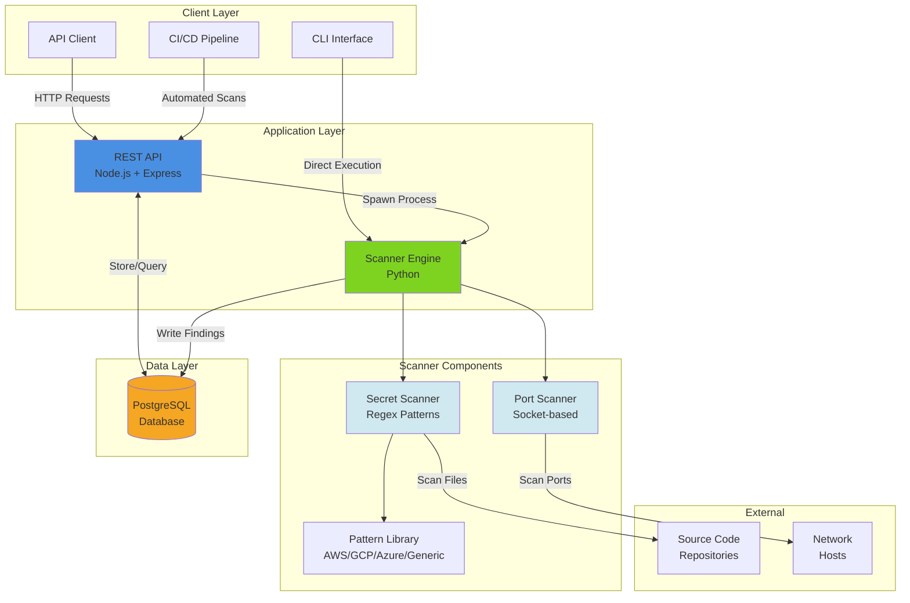

# freesscan

Self-hosted vulnerability scanner for detecting hardcoded secrets and performing network port scans. Provides a REST API for integration with CI/CD pipelines and stores findings in PostgreSQL for tracking and remediation.

## Architecture



## Features

- **Secret Detection**: Scan source code repositories for hardcoded credentials, API keys, and private keys
- **Port Scanning**: Identify open ports and services on network hosts
- **REST API**: Full HTTP API for programmatic access and CI/CD integration
- **Database Storage**: PostgreSQL backend for persistent scan history and findings
- **CLI Interface**: Command-line tool for standalone scanning
- **Customizable Patterns**: Extensible regex-based detection rules
- **False Positive Management**: Mark and track reviewed findings

## Technology Stack

- Python 3.9+ (scanner engine)
- Node.js 18+ with Express (REST API)
- PostgreSQL 15+ (data storage)
- Docker & Docker Compose (deployment)
- Bash (automation scripts)

## Quick Start

### Using Docker Compose

```bash
git clone https://github.com/cer4sco/freesscan.git
cd freesscan

# Start all services
docker-compose up -d

# Run a scan via API
curl -X POST http://localhost:8080/api/scans \
  -H "Content-Type: application/json" \
  -d '{"scan_type": "secret", "target": "/path/to/repo"}'

# Get scan results
curl http://localhost:8080/api/scans/1
```

### Manual Installation

**Prerequisites:**

- Python 3.9+
- Node.js 18+
- PostgreSQL 15+

**Install Python Scanner:**

```bash
cd scanner
pip install -r requirements.txt
```

**Install API Server:**

```bash
cd api
npm install
```

**Initialize Database:**

```bash
export DB_HOST=localhost
export DB_PASSWORD=your_password
./db/scripts/init-db.sh
```

**Start API Server:**

```bash
cd api
npm start
```

## Usage

### Command-Line Interface

**Scan for secrets:**

```bash
python3 scanner/main.py --type secret --target /path/to/repo
```

**Scan network ports:**

```bash
python3 scanner/main.py --type port --target 192.168.1.1
```

**Custom port range:**

```bash
python3 scanner/main.py --type port --target example.com --port-range 1-1024
```

**Output formats:**

```bash
# JSON output
python3 scanner/main.py --target /repo --format json

# Human-readable text
python3 scanner/main.py --target /repo --format text

# Summary statistics
python3 scanner/main.py --target /repo --format summary
```

### REST API

**Start a scan:**

```bash
curl -X POST http://localhost:8080/api/scans \
  -H "Content-Type: application/json" \
  -d '{
    "scan_type": "secret",
    "target": "/path/to/code"
  }'
```

**Get scan results:**

```bash
curl http://localhost:8080/api/scans/{scan_id}
```

**List all findings:**

```bash
curl http://localhost:8080/api/findings
```

**Filter findings by severity:**

```bash
curl http://localhost:8080/api/findings?severity=CRITICAL
```

**Mark false positive:**

```bash
curl -X PATCH http://localhost:8080/api/findings/{id} \
  -H "Content-Type: application/json" \
  -d '{
    "is_false_positive": true,
    "reviewed_by": "security-team"
  }'
```

**Get summary statistics:**

```bash
curl http://localhost:8080/api/findings/stats/summary
```

### CI/CD Integration

**GitHub Actions:**

```yaml
name: Security Scan
on: [push, pull_request]

jobs:
  scan:
    runs-on: ubuntu-latest
    steps:
      - uses: actions/checkout@v3
      - name: Run security scan
        run: |
          ./scripts/ci-scan.sh
        env:
          SCANNER_API: http://scanner.example.com:8080
          FAIL_ON_CRITICAL: true
```

**GitLab CI:**

```yaml
security-scan:
  stage: test
  script:
    - ./scripts/ci-scan.sh
  variables:
    FAIL_ON_CRITICAL: "true"
    FAIL_ON_HIGH: "false"
```

**Direct script usage:**

```bash
# Fail build on CRITICAL findings
export FAIL_ON_CRITICAL=true
export FAIL_ON_HIGH=false
./scripts/ci-scan.sh
```

## API Reference

### Endpoints

| Method | Endpoint | Description |
| ------ | -------- | ----------- |
| `GET` | `/api/scans` | List all scans |
| `POST` | `/api/scans` | Start new scan |
| `GET` | `/api/scans/:id` | Get scan details |
| `DELETE` | `/api/scans/:id` | Delete scan |
| `GET` | `/api/findings` | List findings |
| `GET` | `/api/findings/:id` | Get finding details |
| `PATCH` | `/api/findings/:id` | Update finding |
| `GET` | `/api/findings/stats/summary` | Get statistics |
| `GET` | `/health` | Health check |

### Scan Types

- `secret`: Scan files for hardcoded credentials
- `port`: Scan network host for open ports
- `full`: Run both secret and port scans

### Severity Levels

- `CRITICAL`: Immediate action required (AWS keys, private keys, exposed databases)
- `HIGH`: High risk (API tokens, passwords, sensitive ports)
- `MEDIUM`: Moderate risk (JWT tokens, uncommon ports)
- `LOW`: Low risk (informational findings)
- `INFO`: General information

## Detection Patterns

### AWS Credentials

- AWS Access Key ID: `AKIA[A-Z0-9]{16}`
- AWS Secret Access Key
- AWS Session Tokens

### Generic Secrets

- API keys and tokens
- Hardcoded passwords
- Private SSH/RSA keys
- GitHub personal access tokens
- Slack tokens
- JWT tokens

### Cloud Providers

- Google Cloud API keys
- Azure connection strings
- Azure client secrets
- Heroku API keys

### Network Services

- Common ports: 21, 22, 23, 80, 443, 3306, 5432, 6379, 27017
- Service banners and version detection
- Risk assessment by port/service type

## Configuration

### Custom Patterns

Create `config/patterns.json`:

```json
{
  "patterns": [
    {
      "name": "custom_api_key",
      "regex": "API_KEY_[A-Z0-9]{32}",
      "severity": "HIGH",
      "description": "Custom API key pattern",
      "remediation": "Move to environment variables"
    }
  ]
}
```

### Scanner Configuration

Create `config/scanner.json`:

```json
{
  "exclude_dirs": [".git", "node_modules", "venv"],
  "exclude_extensions": [".jpg", ".png", ".pdf"],
  "max_file_size_mb": 10
}
```

### Environment Variables

```bash
# Database configuration
DB_HOST=localhost
DB_PORT=5432
DB_NAME=freesscan
DB_USER=scanner
DB_PASSWORD=changeme

# API configuration
PORT=8080
API_PORT=8080

# Scanner behavior
FAIL_ON_CRITICAL=true
FAIL_ON_HIGH=false
```

## Database Schema

The scanner uses PostgreSQL with the following tables:

- `severity_levels`: Severity classifications
- `scans`: Scan execution records
- `findings`: Individual security findings
- `patterns`: Custom detection patterns

Run migrations:

```bash
psql -U scanner -d freesscan -f db/schema.sql
psql -U scanner -d freesscan -f db/seed.sql
```

## Development

### Running Tests

**Python scanner tests:**

```bash
cd tests
npm test -- scanner/
```

**API tests:**

```bash
cd tests
npm test -- api/
```

**All tests:**

```bash
cd tests
npm test
```

**Integration tests:**

```bash
# Prerequisites:
# 1. PostgreSQL container running (via Podman/Docker)
# 2. psql client installed (brew install libpq on macOS)
# 3. Set required environment variables

# macOS: Add libpq to PATH
export PATH="/opt/homebrew/opt/libpq/bin:$PATH"

# Set PostgreSQL password (must match container password)
export POSTGRES_PASSWORD=your_postgres_password

# Run integration test suite
./tests/integration/run-all.sh

# Results logged to: test-results.log
```

**macOS Notes:**

On macOS, `psql` is installed via Homebrew but not added to PATH automatically:

```bash
brew install libpq
export PATH="/opt/homebrew/opt/libpq/bin:$PATH"
```

Add to `~/.zshrc` or `~/.bashrc` for persistence:

```bash
echo 'export PATH="/opt/homebrew/opt/libpq/bin:$PATH"' >> ~/.zshrc
```

### Project Structure

```text
freesscan/
├── scanner/           # Python scanner engine
│   ├── patterns/      # Detection patterns
│   ├── utils/         # Helper modules
│   ├── secret_scanner.py
│   ├── port_scanner.py
│   └── main.py
├── api/               # Express REST API
│   ├── routes/
│   ├── models/
│   ├── middleware/
│   └── server.js
├── db/                # Database schemas
│   ├── schema.sql
│   ├── seed.sql
│   └── scripts/
├── tests/             # Test suite
│   ├── scanner/
│   ├── api/
│   └── fixtures/
├── scripts/           # Automation scripts
│   ├── run-scan.sh
│   ├── ci-scan.sh
│   └── report.sh
├── config/            # Configuration files
└── docker-compose.yml
```

## Deployment

### Docker Compose (Recommended)

```bash
docker-compose up -d
```

Services:

- `freesscan-db`: PostgreSQL database (port 5432)
- `freesscan-api`: REST API (port 8080)
- `freesscan-worker`: Scanner worker

### Kubernetes

See `k8s/` directory for Kubernetes manifests.

### Standalone

1. Install dependencies
2. Configure database
3. Run database migrations
4. Start API server
5. Configure scanner environment

## Security Considerations

- Database credentials should use strong passwords
- API should be behind authentication/authorization layer in production
- Network scanning should only be performed on authorized infrastructure
- Scanner processes should run with minimal privileges
- Findings contain sensitive information and should be access-controlled

## Performance

- Secret scanning: ~1000 files/second (typical)
- Port scanning: Configurable timeout and concurrency
- Database: Indexed for fast query performance
- API: Async processing for long-running scans

## Troubleshooting

**Database connection errors:**

```bash
# Verify PostgreSQL is running
pg_isready -h localhost -p 5432

# Check credentials
psql -h localhost -U scanner -d freesscan
```

**Scanner not finding patterns:**

```bash
# Test pattern matching
python3 scanner/main.py --target tests/fixtures/sample_repo
```

**API server errors:**

```bash
# Check health endpoint
curl http://localhost:8080/health

# View logs
docker-compose logs freesscan-api
```

## Contributing

Contributions are welcome. Please see CONTRIBUTING.md for guidelines.

## License

MIT License - see LICENSE file for details.

## Author

**cer4sco**

## Acknowledgments

- [freeCodeCamp](https://www.freecodecamp.org/) - Skills and curriculum that made this possible
