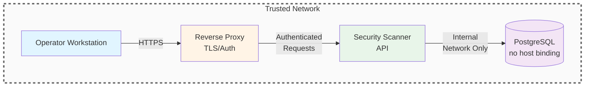

# Security Policy

> Version: 1.0.0 | Last Updated: 2025-12-07

This document describes how to report vulnerabilities, known security limitations, deployment hardening guidance, and the security roadmap for freesscan. Treat the scanner as sensitive infrastructure: it has access to source code, findings data, and potentially internal networks.

## Reporting Security Issues

1. **Do not** open public issues for suspected vulnerabilities.
2. Create a private GitHub security advisory for the repository (Security > Advisories > "Report a vulnerability") and include:
   - Vulnerability description and steps to reproduce
   - Affected commit hash or release tag
   - Any proof-of-concept output/logs
   - Suggested remediation, if available
3. Expect a response within **72 hours**. Please allow up to **14 days** for a coordinated disclosure fix before sharing details publicly.

If an alternative confidential channel is required, note that in the advisory and a maintainer will coordinate securely.

## Supported Versions

| Version | Supported | Notes |
| ------- | --------- | ----- |
| `main` branch | Yes | Latest development snapshot |
| `1.0.x` releases | Yes | Security and critical bug fixes |
| `< 1.0.0` | No | End of support |

Upgrade to the newest tagged release before requesting assistance.

## Threat Model

freesscan v1.0.0 is designed for **trusted operator networks only**.

**Intended deployment:**

- Single-tenant environments
- Isolated CI/CD pipelines
- Local development workstations
- Air-gapped security operations networks

**Not intended for:**

- Public internet exposure
- Multi-tenant SaaS deployments
- Untrusted network segments
- Shared infrastructure without network isolation

**Assumptions:**

- The scanner and API run inside a trusted operations network or private VPC.
- Operators control which repositories/hosts are mounted or reachable from the containers.
- Build agents or CI runners invoking the API are authenticated at the network level.
- PostgreSQL runs on a dedicated network segment not exposed to the public internet.

If any of these conditions are false, apply the hardening steps below before deploying.

## Known Limitations

The following security controls are not implemented in v1.0.0. These are documented intentionally to provide transparency for security-conscious operators.

### Authentication and Authorization

| Gap | Risk | Mitigation |
| --- | ---- | ---------- |
| No API authentication | Unauthorized access to scan operations | Deploy behind authenticated reverse proxy or VPN |
| No role-based access control | All users have full privileges | Restrict network access to authorized operators |
| No API key management | Cannot revoke or rotate credentials | Use network-level access controls |

### Input Validation

| Gap | Risk | Mitigation |
| --- | ---- | ---------- |
| No target allow-list | Arbitrary filesystem traversal | Mount only intended directories in container |
| No SSRF protection on port scans | Internal network reconnaissance | Restrict container network access |
| User-controlled scan targets | Path injection via API | Validate targets at network/firewall level |

### Transport Security

| Gap | Risk | Mitigation |
| --- | ---- | ---------- |
| HTTP by default | Data in transit exposure | Terminate TLS at reverse proxy |
| No certificate validation | Man-in-the-middle risk | Deploy on isolated network segment |

### Data Protection

| Gap | Risk | Mitigation |
| --- | ---- | ---------- |
| Partial secrets stored in database | Credential fragment exposure | Restrict database access, encrypt at rest |
| Full file paths in findings | Internal topology disclosure | Limit API access to authorized personnel |
| No field-level access control | All fields returned to all callers | Deploy behind access-controlled gateway |

### Credential Management

| Gap | Risk | Mitigation |
| --- | ---- | ---------- |
| Default database password | Unauthorized database access | Change DB_PASSWORD before deployment |
| PostgreSQL port exposed to host | Network-level database access | Remove host port binding in production |
| No secrets management integration | Credentials in environment variables | Use orchestrator secrets or vault |

## Hardening Checklist

### API Service

- Enforce authentication (API keys, OAuth2, or mutual TLS) on every route in `api/server.js`.
- Terminate TLS in front of the container; accept only HTTPS traffic from trusted CIDRs.
- Rate-limit and log every `/api/scans` and `/api/findings` request. Consider per-tenant quotas.
- Restrict the `target` parameter; only allow scanning of whitelisted paths/hosts to avoid arbitrary filesystem or network access.
- Run the API container with least privileges (drop `CAP_NET_*`, read-only root filesystem, no shell).

### Scanner Worker

- Execute scans in ephemeral workspaces or sandboxes (e.g., nested containers) so scanning one repository cannot read another.
- Disable outbound network access unless port scanning is explicitly required; use firewall rules to confine scans to authorized ranges.
- Mount source code repositories read-only.
- Keep Python dependencies pinned and up-to-date; run `pip install --require-hashes` when building containers.

### Database

- Generate strong credentials instead of `changeme`, store them in a secrets manager, and inject via environment variables or Docker secrets.
- Require TLS (`sslmode=require`) for the PostgreSQL client configuration.
- Scope database roles: a read/write service account for normal operations and separate read-only roles for reporting.
- Remove the host port mapping in `docker-compose.yml` for production; keep the DB on an internal network only.
- Rotate credentials quarterly and whenever an operator leaves the team.

### Secrets and Configuration

- Never commit `.env` files or API tokens; rely on CI/CD secret stores.
- Enable automatic dependency scanning (npm audit, pip-audit, Trivy image scans) as part of the release pipeline.
- Sign container images or use a registry with provenance verification (e.g., cosign + GitHub OIDC).

### Logging and Monitoring

- Collect API and worker logs centrally; alert on repeated scan creation failures or unusual target patterns.
- Scrub sensitive fields such as `matched_content` before sending logs to SIEM tooling.
- Enable audit logging in PostgreSQL for `findings` and `scans` tables to trace who accessed or modified records.

## Recommended Architecture

## Production Readiness Checklist

Before deploying to production, verify all items:

- [ ] Default database password changed from `changeme`
- [ ] PostgreSQL host port binding removed from docker-compose.yml
- [ ] API deployed behind reverse proxy with TLS termination
- [ ] Network access restricted to authorized IP ranges
- [ ] Container volumes limited to target directories only
- [ ] Database encrypted at rest
- [ ] Backup and recovery procedures documented and tested
- [ ] Logging and alerting configured
- [ ] Incident response runbook prepared

## Security Roadmap

The following enhancements are planned for future releases.

### v1.1.0 - Authentication

- API key authentication
- Per-key rate limiting
- Key rotation support

### v1.2.0 - Input Hardening

- Target allow-list configuration
- Path traversal prevention
- CIDR restrictions for port scanning

### v1.3.0 - Transport Security

- Native TLS termination
- Certificate management
- Secure defaults for all endpoints

### v1.4.0 - Data Protection

- Field-level access control
- Secret hashing option
- Audit logging

### v2.0.0 - Enterprise Features

- Multi-tenant isolation
- RBAC with configurable roles
- Vault integration for secrets
- SARIF output for GitHub Security integration

## Secure Development Practices

- Run `npm test`, `npm audit`, and `pip-audit` before merging patches.
- Use dependabot or renovate for automated dependency updates.
- Require code review for changes touching scanning logic, regex patterns, and database schemas.
- Add regression tests for every new detection rule or parser change.

## Responsible Disclosure Guidelines

We welcome security research. When testing the scanner, **never** scan infrastructure you do not own or have explicit permission to test. Follow all applicable laws and coordinate with us via the reporting channel above.

## Disclaimer

freesscan is provided as-is without warranty. Operators assume full responsibility for securing their deployment according to their organization's requirements and risk tolerance. This tool is designed to assist with security operations but does not guarantee detection of all vulnerabilities.

---

Document Version: 1.0.0
Applies To: freesscan v1.0.0
Classification: Public
